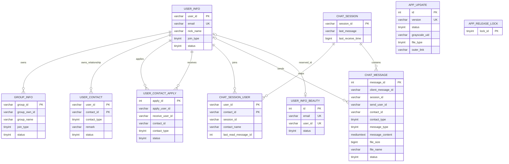

# 数据库结构与逻辑关系

[首页](../README.md) · [更新日志](../CHANGELOG.md) · [REST 契约](api-inventory.md)

依据当前后端 [001 初始化结构](https://github.com/Enderherman/WeTalk/blob/main/sql/001-schema.sql) 核对：**9 张业务表 + 1 张发布事务锁表，共 10 张**。图中仅列关键字段；连线表示应用逻辑关联，SQL 没有声明外键或级联删除。

## 数据含义

| 表 | 关键约束与用途 |
|---|---|
| `user_info` | 用户编号主键，邮箱唯一；普通接口不输出密码摘要 |
| `group_info` | 群编号主键，`group_own_id` 指群主 |
| `user_contact` | `(user_id,contact_id)` 复合主键；好友关系有方向；`remark` 只属于该用户 |
| `user_contact_apply` | 申请编号主键；申请人/接收人/联系人组合唯一 |
| `user_info_beauty` | 编号主键；邮箱及预留用户编号各自唯一 |
| `chat_session` | 会话编号主键；保存最新摘要及时间 |
| `chat_session_user` | 用户/联系人复合主键；保存会话映射和个人已读游标 |
| `chat_message` | 消息编号主键；发送人/客户端 UUID 唯一，支持重试幂等；会话/消息编号索引用于分页 |
| `app_update` | 发布记录，版本号唯一；草稿/灰度/全量状态 |
| `app_release_lock` | 固定 `lock_id=1` 的基础行，用于发布目录事务互斥，不是业务发布记录 |

`contact_id` 可指用户或群，由 `contact_type` 区分，不能画成单一数据库外键。系统消息可能没有发送人。群退群/解散撤销活动会话映射，消息历史与当前访问权限分别处理。

## 初始化与升级

最新 `001-schema.sql` 只供空库，已包含全部迁移结果；除发布锁基础行外不含业务数据。已有库先备份，再按 [后端 SQL 说明](https://github.com/Enderherman/WeTalk/blob/main/sql/README.md) 补尚未执行的迁移：

| 迁移 | 作用 |
|---|---|
| 002 | 消息客户端 UUID 与发送者组合唯一键 |
| 003 | 持久已读游标及未读统计索引 |
| 004 | 会话名称和消息发送人昵称扩为 `varchar(40)` |
| 005 | 消息内容改为 `MEDIUMTEXT`；普通输入及会话摘要仍限 500 字 |
| 006 | 私有备注 `user_contact.remark varchar(40)` |
| 007 | 发布版本唯一索引、发布锁表及基础行；迁移前检查重复版本 |

本轮 004–007 在隔离测试库验证，未迁移 NAS。Redis 保存的会话、票据、验证码和限流状态不属于这 10 张 MySQL 表。
